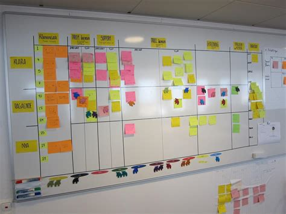

# Enunciado do Projecto 1 - IAED 2020/21

## Data de entrega: 16 de Abril de 2021, às 19h59

## LOG alterações

- 26mar21 - Publicação do enunciado.
- 30mar21 - adicionada a mensagem `invalid duration`.
- 7abr21 - Mooshak aberto para submissões.

## 1. Introdução

O desenvolvimento de projetos complexos, sejam informáticos ou não,
requer a sua subdivisão em tarefas.
Estas tarefas são atribuídas a utilizadores que realizam as atividades
necessárias para completar com êxito cada tarefa.
O método [kanban](https://en.wikipedia.org/wiki/Kanban) foi desenvolvido
pela Toyota, no fim dos anos 40 do século passado, com o objetivo de
facilitar a produção *just-in-time*.
Mais recentemente a Microsoft ([Anderson 2013](https://www.amazon.com/Kanban-David-J-Anderson-ebook/dp/B0057H2M70))
adaptou o conceito ao desenvolvimento de software, mas o *kanban* é
utilizado em diversas outras áreas.
O objectivo deste projeto é o desenvolvimento, em linguagem C,
de um sistema de gestão de tarefas tipo *kanban*.



A interacção com o programa deverá ocorrer através de um conjunto de
linhas compostas por uma letra (comando) e um número de argumentos
dependente do comando a executar.
Pode assumir que todo o *input* fornecido respeitará os tipos indicados,
por exemplo onde é esperado um valor inteiro decimal nunca será
introduzida uma letra.
Os possíveis comandos são listados na tabela seguinte e indicam
as operações a executar.

| Comando | Acção |
|:---:|:---|
| __q__ | termina o programa |
| __t__ | adiciona uma nova tarefa ao sistema |
| __l__ | lista as tarefas |
| __n__ | avança o tempo do sistema |
| __u__ | adiciona um utilizador ou lista todos os utilizadores |
| __m__ | move uma tarefa de uma atividade para outra |
| __d__ | lista todas as tarefas que estejam numa dada atividade |
| __a__ | adiciona uma atividade ou lista todas as atividades |

## 2. Especificação do problema

O objectivo do projecto é ter um sistema de gestão de tarefas de um projeto.
Para tal, o projeto é divido em tarefas, que podem ser executadas em paralelo.
As tarefas são executadas por utilizadores do sistema, que são responsáveis
por elas durante o tempo da sua execução.
Ao longo da sua execução a tarefa vai sendo afetada a diversas atividades.
Cada atividade executa uma operação específica.
O tempo total de execução de uma tarefa deve ser contabilizado para poder
ser comparado com o tempo inicialmente previsto.
Assim, pode-se determinar atrasos na execução do projeto na sua totalidade e,
caso se justifique, afetar mais pessoal.

Como se trata de um simulador, o tempo é controlado pela aplicação através de um comando, não tendo relação com a data ou horas atuais do sistema.
O __tempo__ é iniciado a _0_ (*zero*) e não pode ser decrementado.


Cada __tarefa__ é caracterizada por:

* um identificador (um número inteiro no intervalo [1, 10000])
* uma descrição (uma *string* não vazia com um máximo de __50__ carateres)
* o utilizador que realiza a tarefa
* a atividade em que a tarefa se encontra
* a duração prevista da tarefa (um número inteiro positivo)
* o instante em que a tarefa começou a ser executada (um número inteiro positivo)

Uma __tarefa__ é descrita por uma *string* não vazia com um máximo de
__50__ carateres, podendo conter carateres brancos (espaços ou tabulador `\t`).
O sistema suporta um máximo de __10__ atividades, já existindo à partida
três atividades criadas na sequência: `TO DO`, `IN PROGRESS` e `DONE`.
Uma nova tarefa é inicialmente colocada na atividade `TO DO` com tempo de
início igual a _0_ (zero), independentemente do tempo atual.
A tarefa é iniciada quando abandona a atividade `TO DO`.
Os identificadores das tarefas são únicos.
Pode assumir que existirão no máximo 10 000 tarefas diferentes.
As tarefas são numeradas sequencialmente pela sua ordem de introdução de
1 a 10 000.

Uma __atividade__ é descrita por uma *string* não vazia com um máximo de
__20__ carateres, podendo conter carateres brancos (espaços ou tabulador
`\t`), mas não podendo conter letras minúsculas.
Diversas tarefas podem estar a executar numa mesma atividade, por exemplo *análise de requisitos* ou *debugging*, podendo as tarefas estar atribuídas ao mesmo utilizador ou a utilizadores distintos.
Podem ser adicionadas novas atividades, o que permite detalhar a execução de
uma tarefa desde a sua atividade inicial `TO DO` até à sua atividade final `DONE`.
Uma tarefa, uma vez iniciada não pode voltar à atividade inicial `TO DO`,
mas uma tarefa na atividade `DONE` pode ser movida para outra atividade
(excepto `TO DO`), por exemplo para correção de erros (*bugs*).

Um __utilizador__ é descrito por uma *string* não vazia com um máximo de
20 carateres, não podendo conter carateres brancos.
O sistema suporta um máximo de __50__ utilizadores.

## 3. Dados de Entrada

O programa deverá ler os dados de entrada a partir da linha de comandos do
terminal.

Durante a execução do programa as instruções devem ser lidas do terminal
(*standard input*) na forma de um conjunto de linhas iniciadas por um
carácter, que se passa a designar por comando, seguido de um número de
informações dependente do comando a executar; o comando e cada uma das
informações são separados por pelo menos um caráter branco.

Os comandos disponíveis são descritos de seguida. Cada comando indica
uma determinada acção que se passa a caracterizar em termos de formato
de entrada, formato de saída e erros a retornar. Se o comando gerar mais
do que um erro, deverá ser indicado apenas o primeiro.

  * __q__ - termina o programa:
    * Formato de entrada: `q`
    * Formato de saída: NADA

  * __t__ - adiciona uma nova tarefa ao sistema:
    * Formato de entrada: `t <duração> <descrição>`
    * Formato de saída: `task <id>` onde `<id>` é o identificador da tarefa criada.
    * Nota: a descrição pode conter carateres brancos.
    * Erros:
        * `too many tasks` no caso de a tarefa, se criada, exceder o limite máximo de tarefas permitidas pelo sistema.
        * `duplicate description` no caso de já existir uma tarefa com o mesmo nome.
        * `invalid duration` no caso de a duração não ser um número positivo.

  * __l__ - lista as tarefas:
    * Formato de entrada: `l [<id> <id> ...]`
    * Formato de saída: `<id> <actividade> #<duração> <descrição>` por cada tarefa, uma por linha.
        * Se o comando for invocado sem argumentos, todas as tarefas são listadas por ordem alfabética da descrição.
        * Se o comando for invocado com uma lista de `<id>`s, as tarefas devem ser listadas pela ordem dos respetivos `<id>`s.
    * Erros:
        * `<id>: no such task` no caso de não existir a tarefa indicada.

  * __n__ - avança o tempo do sistema:
    * Formato de entrada: `n <duração>`
    * Formato de saída: `<instante>` onde `<instante>` é novo valor do tempo atual.
    * Nota: uma `<duração>` de zero permite saber o tempo atual sem o alterar.
    * Erros:
        * `invalid time` se a `<duração>` não for um inteiro decimal não negativo.

  * __u__ - adiciona um utilizador ou lista todos os utilizadores:
    * Formato de entrada: `u [<utilizador>]`
    * Formato de saída: lista dos nomes dos utilizadores, um nome por linha, pela ordem de criação ou nada, se for criado um novo utilizador.
    * Erros:
        * `user already exists` no caso de já existir um utilizador com esse nome.
        * `too many users` no caso de o novo utilizador, a ser criado, exceda o limite de utilizadores.
  
  * __m__ - move uma tarefa de uma atvidade para outra:
    * Formato de entrada: `m <id> <utilizador> <atividade>`
    * Formato de saída: `duration=<gasto> slack=<slack>` onde `<gasto>` é o tempo que a tarefa gastou desde que saiu de atividade `TO DO` até atingir a atividade `DONE` e `<slack>` é a diferença entre o tempo `<gasto>` e o tempo previsto (indicado na criação da tarefa); se a `<atividade>` não for `DONE`, nada deve ser impresso, exceto erro.
    * Nota: Uma vez iniciada uma tarefa, e registado o seu instante de início, a tarefa não pode ser reiniciada; no entanto, uma tarefa dada como concluída pode ser movida para uma atividade que não `TO DO`, para a resolução de problemas entretanto encontrados, por exemplo.
    * Erros:
        * `no such task` no caso de não existir nenhuma tarefa com o identificador indicado.
        * `task already started` no caso se tentar mover a tarefa para a atividade `TO DO`.
        * `no such user` no caso de não existir nenhum utilizador com o nome indicado.
        * `no such activity` no caso de não existir nenhuma atividade com o nome indicado.
  
  * __d__ - lista todas as tarefas que estejam numa dada atividade:
    * Formato de entrada: `d <atividade>`:
    * Formato de saída: `<id> <início> <descrição>` por cada tarefa que está na atividade, uma por linha, por ordem crescente de instante de início (momento em que deixam a atividade `TO DO`) e alfabeticamente por descrição, se duas ou mais tarefas tiverem o mesmo instante de início.
    * Erros:
        * `no such activity` no caso de não existir nenhuma atividade com esse nome.
  
  * __a__ - adiciona uma atividade ou lista todas as atividades:
    * Formato de entrada: `a [<atividade>]`
    * Formato de saída: lista de nomes de atividades por ordem de criação, uma por linha, ou nada, se for a criação de uma nova atividade (exceto erro).
    * Erros:
        * `duplicate activity` no caso de já existir uma atividade com o mesmo nome.
        * `invalid description` no caso de o nome da atividade conter letras minúsculas.
        * `too many activities` no caso da atividade, se criada, exceder o limite permitido de atividades.

__Só poderá usar as funções de biblioteca definidas em `stdio.h`,
`stdlib.h`, `ctype.h` e `string.h`__

*Nota importante*: não é permitida a utilização da função `qsort` nativa do C e este *nome* não deve aparecer no vosso código.

O compilador a utilizar é o `gcc` com as seguintes opções de compilação:
`-Wall -Wextra -Werror -ansi -pedantic`. Para compilar o programa deve
executar o seguinte comando:

```
    $ gcc -Wall -Wextra -Werror -ansi -pedantic -o proj1 *.c
```

O programa deverá escrever no *standard output* as respostas aos comandos
apresentados no *standard input*. As respostas são igualmente linhas de
texto formatadas conforme definido anteriormente neste enunciado.
Tenha em atenção ao número de espaços entre elementos do seu output,
assim como a ausência de espaços no final de cada linha. Procure respeitar
escrupulosamente as indicações dadas.

Ver os exemplos de input e respectivos output na pasta `tests/`.

O programa deve ser executado da forma seguinte:

```
    $ ./proj1 < test.in > test.myout
```

Posteriormente poderá comparar o seu output (`*.myout`) com o output previsto (`*.out`) usando o comando `diff`,

```
    $ diff test.out test.myout
```

Para testar o seu programa poderá executar os passos indicados acima ou usar o comando `make` na pasta `tests/`.

## 5. Entrega do Projecto

A entrega do projecto deverá respeitar o procedimento seguinte:

* Na página da disciplina aceda ao sistema para entrega de projectos. O sistema será activado uma semana antes da data limite de entrega. A entrega do 1º projecto é feita unica e exclusivamente usando o sistema Mooshak. Não serão aceites quaisquer outras formas de submissão.

* Efectue o upload de um ficheiro de arquivo com extensão `.zip` que inclua todos os ficheiros fonte que constituem o programa, sem diretorias.
  * Se o seu código tiver apenas um ficheiro, o zip conterá apenas esse ficheiro.
  * Se o seu código estiver estruturado em vários ficheiros (`.c` e `.h`), não se esqueça de os juntar também ao pacote.

* Para criar um ficheiro arquivo com a extensão `.zip` deve executar o seguinte comando __na directoria onde se encontram os ficheiros__ com extensão `.c` e `.h` (se for o caso), criados durante o desenvolvimento do projecto:

```
        $ zip proj1.zip *.c *.h
```

* Como resultado do processo de upload será informado se a resolução entregue apresenta a resposta esperada num conjunto de casos de teste.

* O sistema não permite submissões com menos de 10 minutos de intervalo para o mesmo aluno. Tenha especial atenção a este facto na altura da submissão final. Exemplos de casos de teste serão oportunamente fornecidos. O tempo de avalição do projeto é inferior a 3 minutos.

* Data limite de entrega do projecto: __16 de Abril de 2021, às 19h59m__. Até à data limite poderá efectuar o número de submissões que desejar, sendo utilizada para efeitos de avaliação a última submissão efectuada. Deverá portanto verificar cuidadosamente que a última submissão corresponde à versão do projecto que pretende que seja avaliada. Não existirão excepções a esta regra.

## 6. Avaliação do Projecto

Na avaliação do projecto serão consideradas as seguintes componentes:

1. A primeira componente avalia o desempenho da funcionalidade do programa realizado. Esta componente é avaliada entre 0 e 16 valores.

2. A segunda componente avalia a qualidade do código entregue, nomeadamente os seguintes aspectos: comentários, indentação, estruturação, modularidade, abstracção, entre outros. Esta componente poderá variar entre -4 valores e +4 valores relativamente à classificação calculada no item anterior e será atribuída posteriormente.
Algumas *guidelines* sobre este tópico podem ser encontradas [aqui](guidelines.md).

* A classificação da primeira componente da avaliação do projecto é obtida através da execução automática de um conjunto de testes num computador com o sistema operativo GNU/Linux. Torna-se portanto essencial que o código compile correctamente e que respeite o formato de entrada e saída dos dados descrito anteriormente. Projectos que não obedeçam ao formato indicado no enunciado serão penalizados na avaliação automática, podendo, no limite, ter 0 (zero) valores se falharem todos os testes. Os testes considerados para efeitos de avaliação poderão incluir (ou não) os disponibilizados na página da disciplina, além de um conjunto de testes adicionais. A execução de cada programa em cada teste é limitada na quantidade de memória que pode utilizar, e no tempo total disponível para execução, sendo o tempo limite distinto para cada teste.

* Note-se que o facto de um projecto passar com sucesso o conjunto de testes disponibilizado na página da disciplina não implica que esse projecto esteja totalmente correcto. Apenas indica que passou alguns testes com sucesso, mas este conjunto de testes não é exaustivo. É da responsabilidade dos alunos garantir que o código produzido está correcto.

* Em caso algum será disponibilizado qualquer tipo de informação sobre os casos de teste utilizados pelo sistema de avaliação automática. A totalidade dos ficheiros de teste usados na avaliação do projecto serão disponibilizados na página da disciplina após a data de entrega.

## 7. Dicas para Desenvolvimento do Projecto

Abaixo podem encontrar algumas dicas simples que facilitam o despiste de erros comuns no desenvolvimento do projecto.
Sugerimos que __desenvolvam os vossos projectos de forma incremental e que testem as vossas soluções localmente antes de as submeterem no Mooshak__.
Também é desejável que tenham o projeto funcional à data da abertura do Mooshak por forma a poderem tirar completo partido deste.

Sugerimos que sigam os seguintes passos:

1. Desenvolva e corrija o código de forma incremental garantindo que compila sem erros nem *warnings*. Não acumule uma série de erros pois o *debug* é tanto mais complexo quanto a dimensão da base de código a analisar.
2. Garanta que está a ler o *input* e a escrever o *output* correctamente, em particular garanta que as *strings* não ficam com espaços extra, `\n` no final, que a formatação está correcta e de acordo com o que está no enunciado, *etc*.
3. Procure desenvolver os comandos pela ordem apresentada.
4. Teste isoladamente cada comando e verifique que funciona correctamente.
